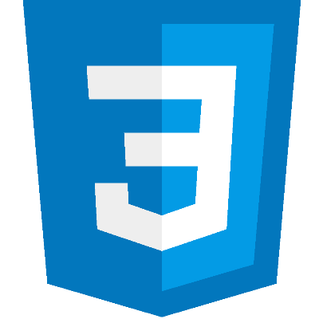
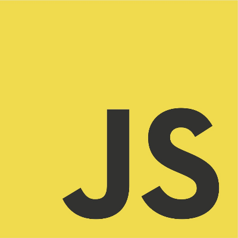
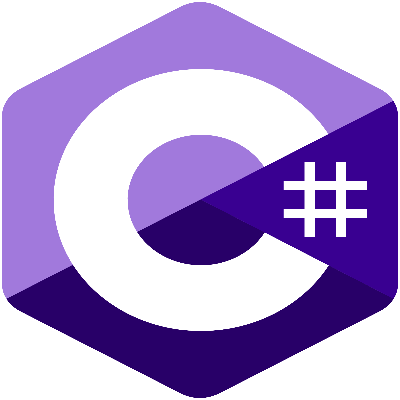
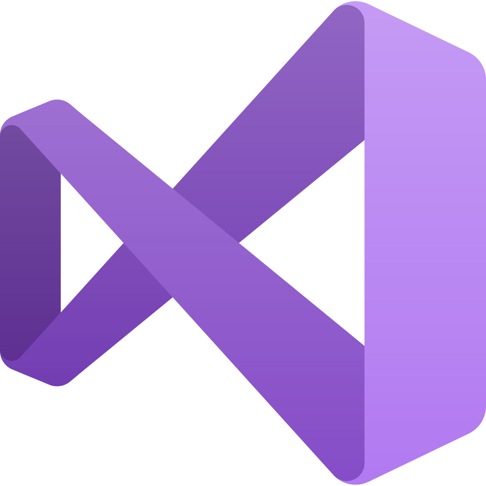

 

<h2 align="center">
 Hi, my name is Rozbita Zaluzie
 </h2>
 
 <h4 align="center"> I'm learning programing, web development, game making and sometimes 3D art</h4>

  
 
  <h3 align="center">Front-end </h3>
 

   ⠀
   ⠀
   
 
 
  
  <h3 align="center">Back-end / Databases </h3>
 

  ⠀
  ⠀
 
 
 
  <h3 align="center">Programing </h3>
 

    ⠀
 ⠀
 ⠀
 
 
 
  <h3 align="center">IDEs / Tools </h3>
 

   ⠀
 ⠀
 ⠀
 ⠀
 ⠀
 ⠀
 

  
  

---

⠀

⠀

